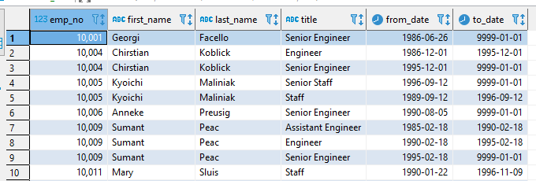
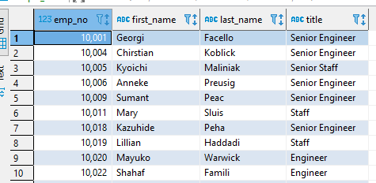
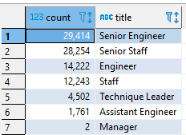
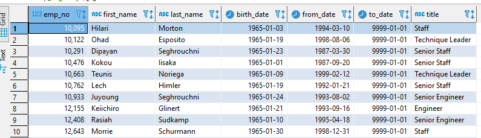
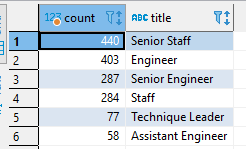
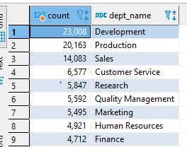

# Pewlett-Hackard-Analysis

## Overview:
Pewlett Hackard is a large company with several thousand employees. The company would like to determine the retirement criteria, 
number of retirees, and which positions need to be filled in the future.

## Purpose:-
To determine the number of retiring employees per title, and to identify employees who are eligible to participate in a mentorship program.

## Deliverable 1: The number of Retiring Employees by Title 

## Results:- 
The table below shows that all emplyees who were born between Januray 1, 1952 and December 31, 1955.  

In the above table some employees had duplicate entities. We removed such duplicates using DISTINCT ON statement and created a Unique title. 
Finally, we sorted the table in ascending order by employee number and descending order by the last date of the most recent title. 

Below is a retiring titles table shows the number of employees by their most recent job titles who are about to retire. 

## Deliverable 2: The Employees Eligible for the Mentorship Program
## Results:-  
The other analysis was a mentorship-eligibility table that holds the current employees who were born between January 1, 1965 and December 51, 1965. 

## Summary: 
- A total of 90,398 positions will need to be filled as the silver tsunami begins to make an impact. 
- The total number of mentorship-eligibility is 1549. The company has 300,024 employees of which 31.1% are going to be retiring. 
  The Number of Retiring by department table shows (refer to the table below) that Development section has the highest retirees 
  (23,008) followed by Production section (20,163).  Taking these data into consideration the company will face a shortage of qualified mentors. 
  Similarly, from the above retiring table, two managers are about to retire. However, the number of eligible mentors by their most recent job titles 
  (refer to the table below) shows that there is no manager listed as mentorship eligibility thus the company will face a shortage of mentors in the management position as well. 

### Table 1. Number of employees eligible for mentorship by title
                  

### Table 2. Number of retiring employees by department 

